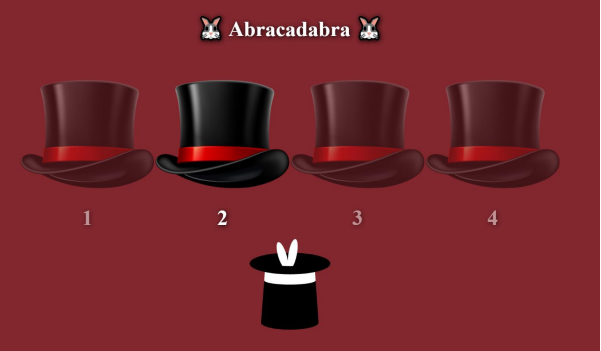

# Desafío evaluado - Abracadabra

## Descripción

En este desafío, se valida el conocimiento en Node.js y Express mediante la creación de rutas, el manejo de objetos `Request` y `Response`, el uso de middlewares, y la devolución de sitios web estáticos. El objetivo es desarrollar un servidor que sirva un sitio web estático con una temática de magia, en el cual los usuarios pueden interactuar con una interfaz que presenta cuatro sombreros. Al hacer clic en uno de estos sombreros, se debe mostrar una imagen de un conejo oculto si se acierta el número aleatorio generado en el servidor.

## Vista Codificada

A continuación, se muestra la imagen del resultado codificado:

## Requerimientos

1. **Crear un servidor con Express en el puerto 3000.**
2. **Definir la carpeta `assets` como carpeta pública del servidor.**
3. **Crear un arreglo de nombres en el servidor y devolverlo en formato JSON a través de la ruta `/abracadabra/usuarios`.**
4. **Crear un middleware en la ruta `/abracadabra/juego/:usuario` para validar que el usuario recibido como parámetro `usuario` existe en el arreglo de nombres.**
   - Si el usuario es válido, permitir el paso a la ruta GET correspondiente.
   - Si el usuario no existe, devolver la imagen `who.jpeg`. 
5. **Crear una ruta `/abracadabra/conejo/:n` que valide si el parámetro `n` coincide con el número generado de forma aleatoria.**
   - Si el número coincide, devolver la imagen del conejo.
   - Si no coincide, devolver la imagen de Voldemort.
6. **Crear una ruta genérica que devuelva un mensaje "Esta página no existe" al consultar una ruta que no esté definida en el servidor.**

## Estructura del Proyecto

- **`server.js`**: Archivo principal que configura y arranca el servidor Express. Incluye la configuración de rutas y middlewares.
- **`assets/`**: Carpeta pública que contiene todos los archivos estáticos accesibles desde el navegador.
  - **`img/`**: Carpeta con imágenes, incluyendo `sombrero.png`, `conejo.png`, `voldemort.png`, y `who.jpeg`.
  - **`index.html`**: Archivo HTML que sirve como la interfaz principal de la aplicación.

## Tecnologías Utilizadas

- **Node.js**: Entorno de ejecución para JavaScript en el servidor.
- **Express**: Framework para Node.js que facilita la creación y manejo del servidor y las rutas.
- **HTML5**: Estructura de la página web.
- **CSS3**: Estilos para la página web.

## Autor

Este proyecto fue desarrollado por **Valeria Torrealba**.